# Organic Mesh Growth

**University of Pennsylvania, CIS 565**

*A Vulkan implementation by [Mohamad Moneimne](https://github.com/moneimne) and [Mariano Merchante](https://github.com/mmerchante)*

## Project Overview

[INSERT VIDEO LINK HERE]

In this project, we explore a GPU-based approach for mesh deformation through the use of **signed distance fields** (SDFs). An SDF can be thought of as a three dimensional grid of data in which each cell corresponds to the distance to the nearest surface. This means that cells outside of the mesh are positive, cells on the surface are approximately zero, and cells within the mesh are negative. With this information, we proposed the ability to deform the mesh at each timestep through the use of compute shaders in Vulkan. We then are able to raymarch the SDF to visualize the results of our simulation in real-time.

## Pipeline Overview

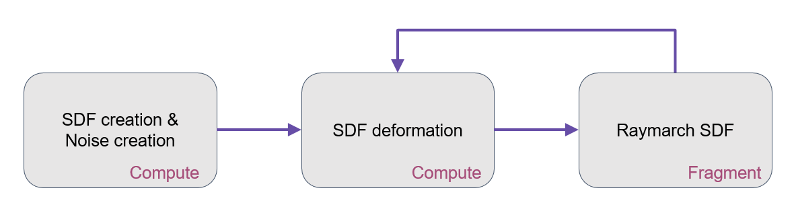

We use the Vulkan graphics and compute API in order to achieve our results. The overall setup of our project involves three phases:
  * SDF generation
  * SDF deformation
  * SDF visualization

**SDF generation** occurs once per instance of the application as a preprocess step. This is done using a compute shader in which each thread (or shader invocation) is responsible for populating a single cell in the SDF. Additional 3D textures can be created here which will be used during the deformation, such as Perlin and Worley noise.

**SDF deformation** occurs once per frame, propagating the simulation of our deformations. Similarly to SDF generation, this is done in a compute shader in which each thread is responsible for determining how the SDF should change at a given cell. This is accomplished by using combinations of convolution kernels and vector fields in order to determine the displacement of distances along the SDF.

**SDF visualization** occurs once per frame, allowing us to see the geometry as the simulation progresses. This is done using a graphics pipeline in which we rasterize a cube that represents the bounds of our SDF. In the fragment shader, we then are able to raymarch through the cube and poll the SDF for distances to the surface. While doing this, we continue to march until we receive a distance of zero or less, indicating we have reached the mesh.

## SDF Generation
- Turn of TDR

## SDF Deformation
A large part of this project was attempting to formalize the types of deformations that can occur on an SDF. Because of the 3D grid nature of SDFs, we decided to introduce two main types of deformations:
  * Kernel displacements
  * Vector field displacements
  
**Kernel Displacements**

These kinds of displacements are simply implemented as 3D convolution kernels. For every cell in the SDF, we induce a displacement based on information from our direct neighbors. Although this has the potential for highly expressive kernels, we were only able to find one within the alotted time: relaxation.

*Relaxation*

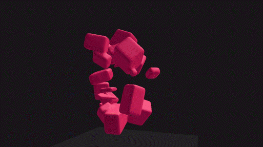

In this kernel, we essentially just return the average of a cell and its neighbors within a certain kernel radius. For each cell, this colloquially means something along the lines of, "I want to be more like my neighbors". This means that areas of high frequency will begin to smooth out as cells corresponding to concave areas will begin to fill out and cells corresponding to convex areas will begin to retract. This ends up looking like a "smoothing" effect, which is why we dubbed it "relaxation". This deformation turns out to be an integral part of all our compound deformations since it reduces potential artifacts from saturation of cells in our SDF.

**Vector Field Displacements**

These kinds of displacements refer to any other type of deformations in which we poll some function in order to determine how each cell should displace. So far, these include expansion, gravity, planar expansion, noise expansion, curl expansion, repulsion, and curvature expansion.

*Expansion*

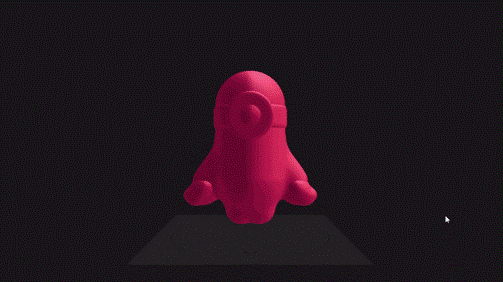

Expansion is the simplest vector field to think of. Essentially, we are just continuously expanding the entire SDF by some constant, which can be positive or negative. A negative expansion will cause or mesh to puff up, since we are reducing the distances to the mesh along our SDF, while a positive expansion will cause our mesh to uniformly decay.

*Gravity*

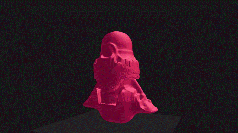

Gravity can be thought of as an expansion along a specified direction. Given this direction, we can use the dot product between the normal and the gravity direction such that growth only occurs when they are aligned. For example, when the gravity direction is downward, the mesh will grow purely downwards when the normal is aligned.

*Planar Expansion*

[ INSERT GIF ]

This expansion is similar to gravity. It takes in a specified direction, but instead of growing in that direction, we grow in the plane that is perpindicular to it. This allows for radial growth patterns based on similar dot product analysis as in gravity.

*Noise Expansion*

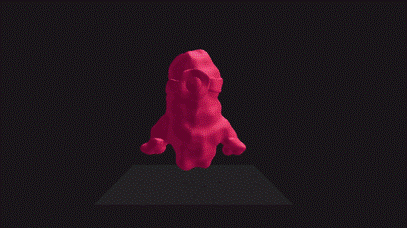

In the previous displacement types, we were able to determine displacements based on the properties at our cell. In noise expansion, we instead poll another precomputed 3D texture for displacements. This can be processed however you please, but we define these displacements as noise functions. Specifically, we use Perlin and Worley noise to guide a slightly chaotic growth pattern.

*Curl Expansion*

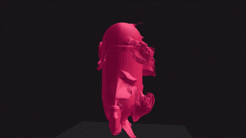

This deformation can be thought of as a mix between gravity and noise expansion. We first precompute a 3D texture with curl noise, which represents directions along which the mesh can grow. We then use a dot product analysis simlar to gravity so that the mesh only grows when the normal is aligned with the curl noise direction.

*Repulsion*

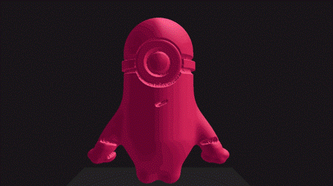

A lot of behaviors we've seen in similar work show signs of repulsion between surfaces, so we attempted to apply this to our model as well. In order to achieve this, we use a sampling method. For each cell that represents a surface, we use hemispheric sampling in order to determine proximity to other surfaces. If the samples fall within a negative region of the SDF, the sample contributes some amound of repulsion in the opposite direction. At the moment, this causes meshes to have a tendency to "eat away at itself" if concave sections are introduced by other displacements.

*Curvature Expansion*

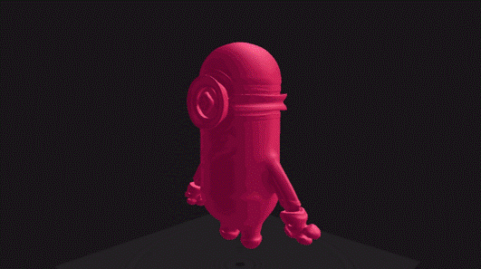

As one of the more expressive displacements, we wanted to be able to deform a meshes based on the curvature at any point. We do this by defining curvature as the magnitude of change in the normal around a cell. We can provide offset values to this function in order to determine at what scale we want to assess curvature. A smaller offset will catch curvature introduced by tiny ridges while a larger offset will introduce growth based on the higher-level topology of the mesh. Upon finding the magnitude of curvature, we expand the mesh along the normals based on this magnitude, causing points of higher frequency to grow faster.

If you'd like more details on how these are implemented, feel free to check out our [displacement compute shader](https://github.com/mmerchante/organic-mesh-growth/blob/master/src/OrganicMeshGrowth/OrganicMeshGrowth/shaders/kernel.comp)!

## SDF Visualization

In order to visualize the SDF, we simply raymarch through the SDF until we hit a cell with a distance of zero or less. This is done in a regular graphics pipeline, where the vertex shader positions the geometry to be raymarched through and the fragment shader does the raymarch. For the vertex shader, traditional implementations use a quad on the near-plane of the view frustum, which would allow us to raymarch the entire view-frustum. This makes sense for most cases, but we are actually only raymarching in a cubicly-bound volume. Because of this, we can instead rasterize a cube that corresponds to the bounds of our SDF. By doing this, we only raymarch through fragments that are introduced by the cube in the fragment shader, essentailly culling everything outside of the cube. This allows us to speed up our raymarching significantly when the camera is farther away from the mesh.

By mixing and matching our different displacements, we are able to achieve highly expressive deformations as can be seen in the demo video linked at the top of this page.

## Performance Analysis

**Simulation Size**

An important aspect of our project is the size at which we run the simulation. Since the SDF is a 3D grid, we can define the simulation at various resolutions. Below is a description of how our renderer's speed scales with different simulation resolutions. The block size is fixed at 8 cubed.

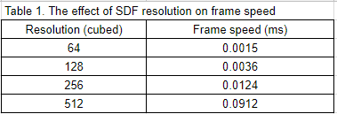

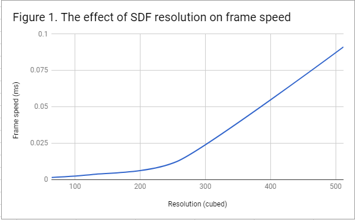

As can be seen, the amount of time it takes to per frame increases exponentially with respect to the SDF resolution. For this reason, we found that a resolution of 256 cubed was a happy medium to ensure real-time rates while preserving surface detail of the mesh.

**Shared Memory for Kernels**

A typical optimization for convolution kernels in compute shaders is to use shared memory. When running a convolution kernel, the simulation asks for each SDF cell to reads its neighbor's values from global memory. This is expensive considering we poll the SDF for a given position multiple times, including while calculating the normal of a surface, which scales based on the half-width of our convolution kernel. Due to this repetition, it benefits us to load the SDF values into shared memory before performing the convolution. This is because shared memory is closer to the chip than global memory, but shared memory is only accessible on a per-block basis. Because of this restriction, we need to introduce barriers between writing to shared memory and reading from it as threads cooperatively load the SDF values. The figure below shows the impact of using shared memory use.

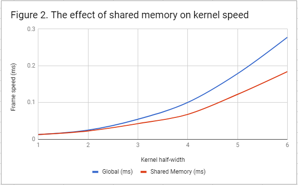

As can be seen, with a kernel width of 1, shared memory doesn't give us any benefit, likely because of the overhead introduced by the barrier. However, once we increase the kernel half-size, the simulation speed with shared memory doesn't slow down as fast as with global memory. In our observations this made a kernel half-size of 2 and 3 viable since it maintains interactive rates as compare to global memory. Any kernel half-size past this is too slow for use, even with shared memory.

**SDF Generation**
